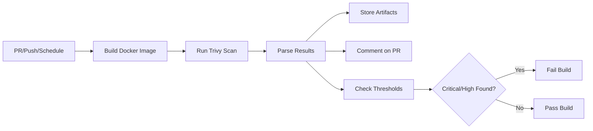

# Container Scanning Solution for Free GitHub Edition - Summary

This solution provides comprehensive container vulnerability scanning that works with **free GitHub accounts** without requiring GitHub Enterprise or Advanced Security features.

## 🎯 Problem Solved

The original workflow used `github/codeql-action/upload-sarif@v3` which requires GitHub Advanced Security (Enterprise feature). This prevented users on free GitHub accounts from getting container scan results.

## ✅ Solution Components

### 1. New Workflow: `container-scan-free.yml`
- **Trivy Integration**: Uses the same vulnerability scanner as the original
- **Artifact Storage**: Stores scan results as downloadable workflow artifacts (30-day retention)
- **PR Comments**: Automatically posts vulnerability summaries on pull requests
- **Build Failures**: Fails builds on critical/high severity vulnerabilities
- **Multiple Formats**: Generates JSON, table, and summary reports

### 2. Local Scanning Script: `scripts/container-scan.sh`
- **Auto-installation**: Can automatically install Trivy
- **Multiple Formats**: Generates table, JSON, and HTML reports
- **Colored Output**: User-friendly terminal interface
- **Flexible Options**: Supports various scanning scenarios
- **Cross-platform**: Works on Linux and macOS

### 3. Documentation Suite
- **SECURITY.md**: Updated with free-edition compatible instructions
- **README.md**: Updated badge and feature highlights
- **SCANNING_GUIDE.md**: Comprehensive usage guide
- **MIGRATION_GUIDE.md**: Step-by-step migration from Enterprise workflow

### 4. Configuration Files
- **.gitignore**: Excludes scan result files from version control
- **Error Handling**: Robust error handling in all components

## 🔄 How It Works

### Automated Workflow


### Result Access Methods
1. **PR Comments**: Immediate summary with vulnerability counts
2. **Workflow Artifacts**: Downloadable detailed reports
3. **Workflow Logs**: Real-time scan output
4. **Local Scanning**: Development-time scanning

## 📊 Feature Comparison

| Feature | Enterprise Workflow | Free Edition Workflow |
|---------|-------------------|---------------------|
| Vulnerability Scanning | ✅ | ✅ |
| Security Tab Integration | ✅ | ❌ (Not available on free) |
| PR Comments | ❌ | ✅ |
| Workflow Artifacts | ❌ | ✅ |
| Build Failures | ✅ | ✅ |
| Local Scanning Script | ❌ | ✅ |
| Multiple Report Formats | Limited | ✅ |
| Comprehensive Docs | ❌ | ✅ |

## 🚀 Usage Examples

### Automated Scanning
```yaml
# Triggers automatically on:
# - Pull requests to main/master
# - Pushes to main/master  
# - Weekly schedule (Sundays at midnight UTC)
```

### Local Development
```bash
# Quick scan with auto-installation
./scripts/container-scan.sh --install-trivy

# Scan existing image
./scripts/container-scan.sh --no-build -i myimage:latest

# Custom output directory
./scripts/container-scan.sh -o /path/to/results
```

### Accessing Results
1. **PR Comments**: Check pull request for automated comment
2. **Actions Tab**: Download artifacts from workflow runs
3. **Local Files**: Results saved in `./scan-results/` directory

## 🛡️ Security Benefits

### Maintained Security Posture
- Same Trivy vulnerability database
- Identical severity classifications
- Same failure thresholds for builds
- Comprehensive vulnerability coverage

### Enhanced Visibility
- Real-time PR feedback
- Persistent artifact storage
- Development-time scanning
- Multiple report formats

### Free Tier Compatibility
- No licensing requirements
- Works on all GitHub account types
- No feature limitations for core scanning

## 📝 Files Created/Modified

### New Files
- `.github/workflows/container-scan-free.yml` - Free edition workflow
- `scripts/container-scan.sh` - Local scanning script
- `SCANNING_GUIDE.md` - Usage guide
- `MIGRATION_GUIDE.md` - Migration instructions  
- `.gitignore` - Ignore scan result files

### Modified Files
- `README.md` - Updated with new workflow badge and features
- `SECURITY.md` - Added free edition documentation

## 🎉 Benefits for Users

1. **No Cost**: Works with free GitHub accounts
2. **Better Feedback**: PR comments provide immediate visibility
3. **Offline Capability**: Local scanning script for development
4. **Comprehensive Reports**: Multiple formats for different needs
5. **Easy Migration**: Minimal changes required to switch
6. **Maintained Security**: Same level of vulnerability detection

## 🔧 Technical Implementation

- **Trivy Integration**: Uses official `aquasecurity/trivy-action`
- **GitHub Actions**: Standard actions for comments and artifacts
- **JSON Processing**: Uses `jq` for result parsing
- **Cross-platform Script**: Bash script with OS detection
- **Error Handling**: Comprehensive error checking and reporting

This solution provides enterprise-level container scanning capabilities to users on the free GitHub tier while maintaining all security benefits and adding enhanced usability features.